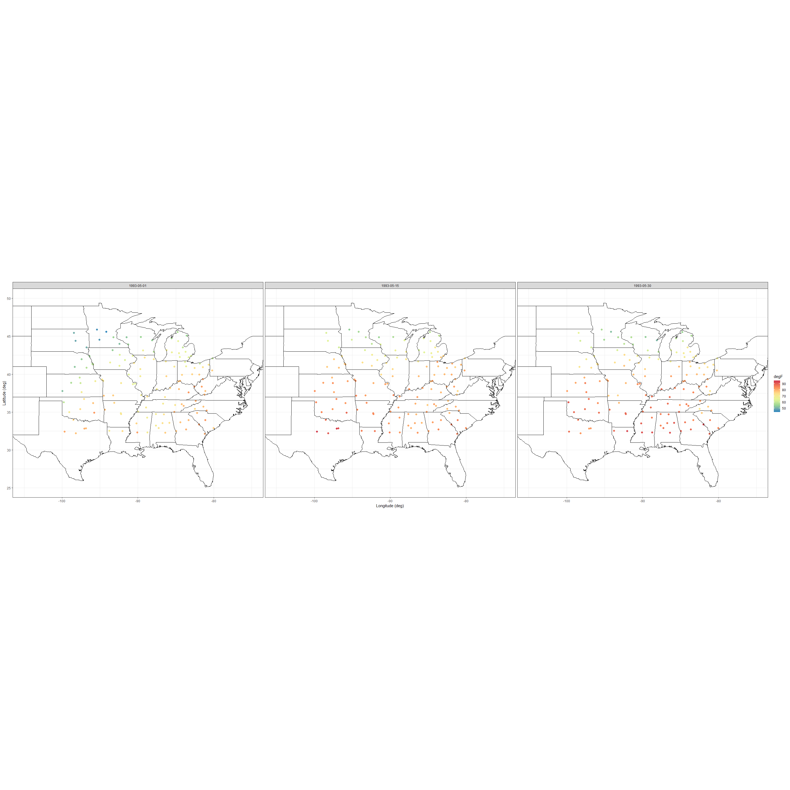
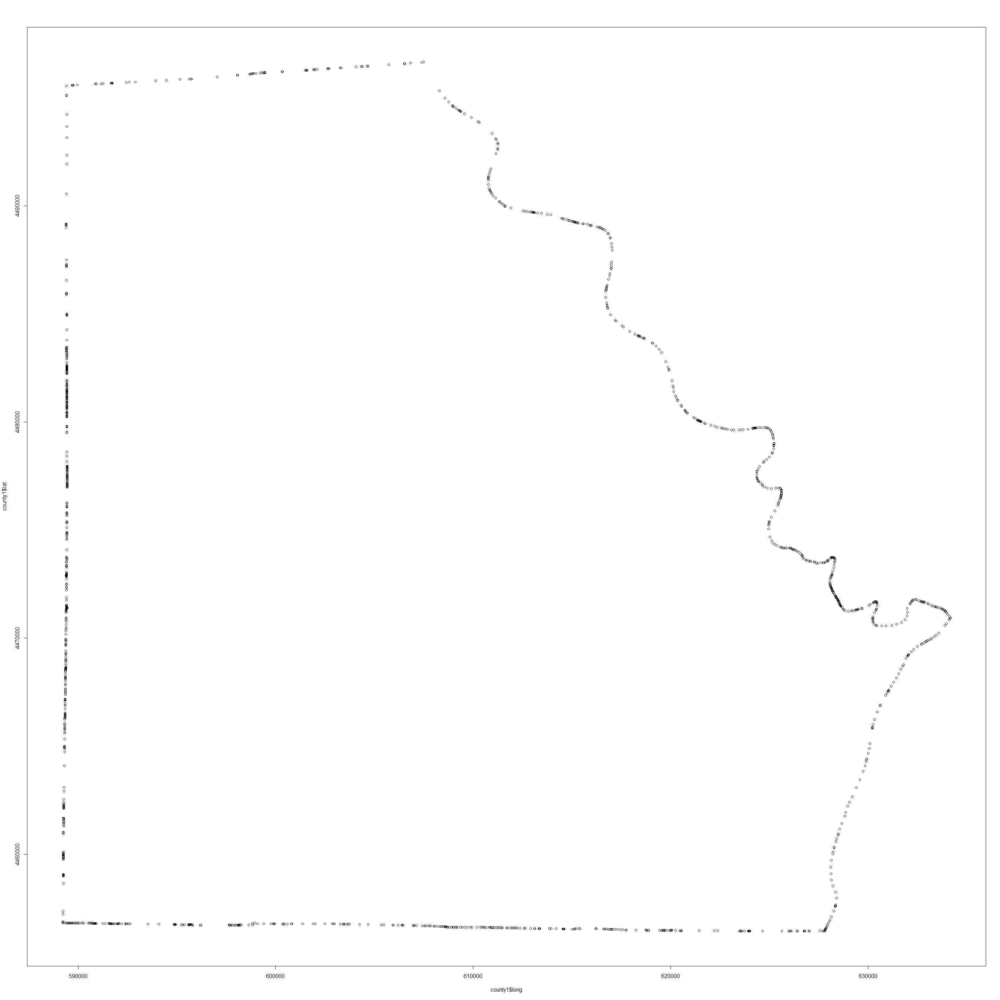
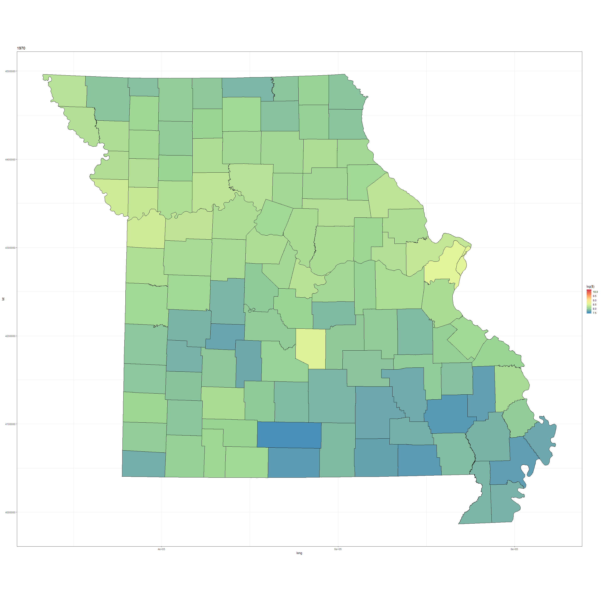
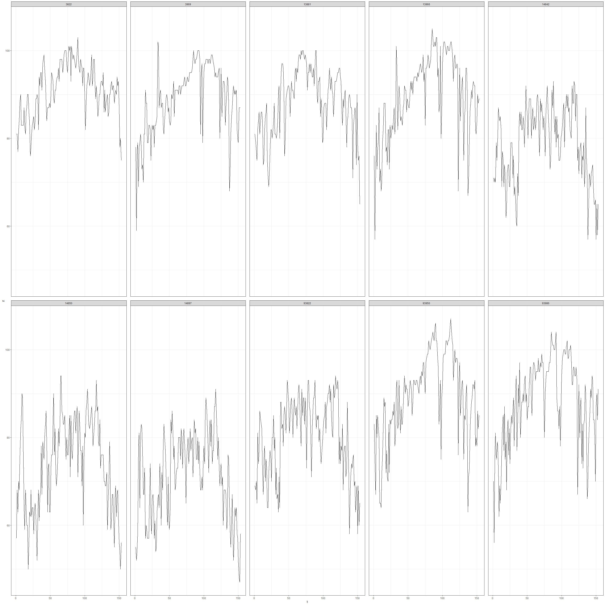
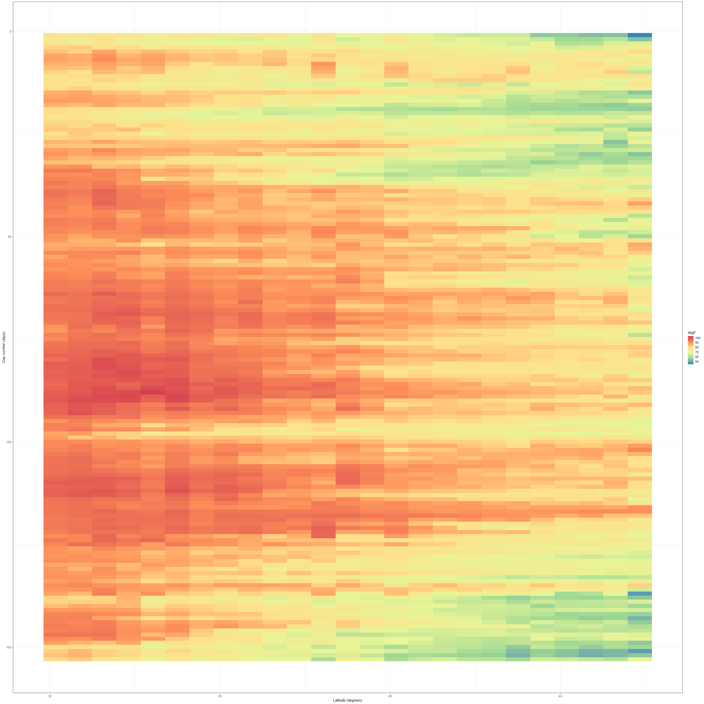

#Visualization

__The first task faced by the spatio-temporal modeler is data visualization__


```r
#Paquetes
library(animation)
library(tidyverse)
library(gstat)
library(maps)
library(STRbook)

set.seed(1)
```


```r
#Data
data("NOAA_df_1990", package = "STRbook")
tmax <- filter(NOAA_df_1990,
               proc=="Tmax" &
               month %in% 5:9 &
               year==1993 )

tmax %>% select(lon,lat,date, julian,z) %>% head()
```

```
##         lon   lat       date julian  z
## 1 -81.43333 39.35 1993-05-01 728050 82
## 2 -81.43333 39.35 1993-05-02 728051 84
## 3 -81.43333 39.35 1993-05-03 728052 79
## 4 -81.43333 39.35 1993-05-04 728053 72
## 5 -81.43333 39.35 1993-05-05 728054 73
## 6 -81.43333 39.35 1993-05-06 728055 78
```

```r
#Create a variable t para que sea facil hacer un subset 

tmax$t <- tmax$julian-728049 
```


#Spatial Plots para puntos fijos

The NOAA data are collected at stations that are fixed in space


```r
#Data from the 1 15 30th day 
head(tmax_1 <- subset(tmax, t %in% c(1,15,30)))
```

```
##     julian year month day   id  z proc      lat       lon       date  t
## 1   728050 1993     5   1 3804 82 Tmax 39.35000 -81.43333 1993-05-01  1
## 15  728064 1993     5  15 3804 80 Tmax 39.35000 -81.43333 1993-05-15 15
## 30  728079 1993     5  30 3804 82 Tmax 39.35000 -81.43333 1993-05-30 30
## 154 728050 1993     5   1 3810 78 Tmax 35.73333 -81.38333 1993-05-01  1
## 168 728064 1993     5  15 3810 80 Tmax 35.73333 -81.38333 1993-05-15 15
## 183 728079 1993     5  30 3810 77 Tmax 35.73333 -81.38333 1993-05-30 30
```
 

```r
noaa_plot <- ggplot(tmax_1) +
  geom_point(aes(x=lon, y= lat,
             colour=z),
             size=2)+
  col_scale(name= "degF")+
  xlab("Longitude (deg)")+
  ylab("Latitude (deg)")+
  
  #Agregar mapa de USA
  geom_path(data = map_data("state"),
            #El group hace que no aparezcan lineas raras
            aes(x = long, y=lat, group=group )) +
  #3 mapas por fecha          
  facet_grid(~date)+
  #Corta el mapa
  coord_fixed(xlim = c(-105,-75),
                        ylim = c(25,50))+
  theme_bw()
            
  
noaa_plot
```

<!-- -->
 
 
#Plots of irregular lattice data

Aca cada columna representa los datos a mapear 

```r
data("BEA", package = "STRbook")

#Los datos no tienen un formato adecuado para el tidyverse
head(BEA %>% select(-Description),3)
```

```
##          NAME10 X1970 X1980 X1990
## 6     Adair, MO  2723  7399 12755
## 9    Andrew, MO  3577  7937 15059
## 12 Atchison, MO  3770  5743 14748
```

```r
data("MOcounties",  package = "STRbook")

#Estos datos se deberia juntar con los de BEA
head(MOcounties %>% select(long,lat,NAME10),3)
```

```
##       long     lat    NAME10
## 1 627911.9 4473554 Clark, MO
## 2 627921.4 4473559 Clark, MO
## 3 627923.0 4473560 Clark, MO
```

```r
#Clark county
county1 <- filter(MOcounties, NAME10 == "Clark, MO")
plot(county1$long,county1$lat)
```

<!-- -->


```r
#Joint data frames
MOcounties <- left_join(MOcounties,BEA, by= "NAME10")
```


```r
#Mapa del county con la columna 1970
g1 <- ggplot(MOcounties)+
  geom_polygon(aes(x=long,y=lat,
                   group= NAME10,
                   fill=log(X1970)))+
#delimita los cuadros pequeños
  geom_path(aes(x=long, y=lat,
                group=NAME10))+
  #Imporante,cambia la escala de colores
  #se se aumenta el limite superior los 
  #colores se aclaran 
  fill_scale(limits = c(7.5,10.2),
             name = "log($)")+
  coord_fixed()+
  ggtitle("1970")+
  theme_bw()
  
  
g1 
```

<!-- -->

#Time-Series Plots


```r
#Select 10  random stations of the 139
# extract ID
UDIs <- unique(tmax$id)

#sample 10 IDs
UDIs_sub <- sample(UDIs, 10)

#subset data
tmax_sub <- filter(tmax, id %in% UDIs_sub)
```

##Facets para visualizar el time series


```r
tmaxts <- ggplot(tmax_sub)+
  geom_line(aes(x=t,y=z))+
  facet_wrap(~id, ncol=5)+
  theme_bw()+
  
  #facet spacing
  theme(panel.spacing = unit(1,"lines"))

tmaxts
```

<!-- -->

#Hovmöller Plots

A Hovmöller plot is a two-dimensional space-time visualization, where space is collapsed
(projected or averaged) onto one dimension; the second dimension then denotes time. A
Hovmöller plot can be generated relatively easily if the data are on a space-time grid, but
unfortunately this is rarely the case!


```r
#Generate a regular grid of 25 spatial points and 100 temporal points

#latitude range min-max
lim_lat <- range(tmax$lat)

#time range
lim_t <- range(tmax$t)

#latitude axis, crear secuencia 
lat_axis <- seq(lim_lat[1],
                lim_lat[2],
                length=25 ) 

t_axis <- seq(lim_t[1],
              lim_t[2],
              length=100)

#Repite 1 25 veces (valores de lat axis)
head(lat_t_grid <- expand.grid(lat = lat_axis,
                          t = t_axis))
```

```
##        lat t
## 1 32.13334 1
## 2 32.70556 1
## 3 33.27778 1
## 4 33.85000 1
## 5 34.42222 1
## 6 34.99445 1
```


```r
#EL problema es que lat tiene valores continuos 
#associate each station’s latitudinal coordinate with the closest one on
#the grid (lat_t_grid)

tmax_grid <- tmax

dist <- abs(outer(tmax$lat, lat_axis, "-"))

tmax_grid$lat <- lat_axis[apply(dist,1,which.min)]
```


```r
tmax_lat_hov <- group_by(tmax_grid, lat, t) %>%
summarise(z = mean(z))
```


```r
(Hovmoller_lat <- ggplot(tmax_lat_hov) + # take data
geom_tile(aes(x = lat, y = t, fill = z)) + # plot
fill_scale(name = "degF") + # add color scale
scale_y_reverse() + # rev y scale
ylab("Day number (days)") + # add y label
xlab("Latitude (degrees)") + # add x label
theme_bw()) # change theme
```

<!-- -->

#Animations


##Crear funcion para crear el grafico


```r
tmax_t <- function(tau){
  
  #subset data
  tmax_sub <- filter(tmax, t == tau)
  
  #plot
  ggplot(tmax_sub)+
    geom_point(aes(x=lon,y=lat,colour=z),
               size=4)+
    col_scale(name = "z", limits = c(40,110))+
    theme_bw()

}
```

##Crear funcion para la animacion 


```r
gen_anim <- function(){
  
  #para cada punto en el tiempo 
  for (t in lim_t[1]:lim_t[2]) {
    plot(tmax_t(t))
    
  }
}
```


```r
#Intervalo de .2s entre cuadros
ani.options(interval=0.2)

saveHTML(gen_anim(),
         #do not play on load
         autoplay= F,
         
         #do not loop
         loop=F,
         
         #do not verbose
         verbose=F, 
         
         #save to current dir
         outdir= ".",
         
         #Botones
         #single.opts="'controls': ['first', 'previous','play', 
         #'next', 'last','loop', 'speed'],'delayMin': 0",
         
         htmlfile = "NOAA_anim.html"
         
         
         )
```

```
## HTML file created at: NOAA_anim.html
```

