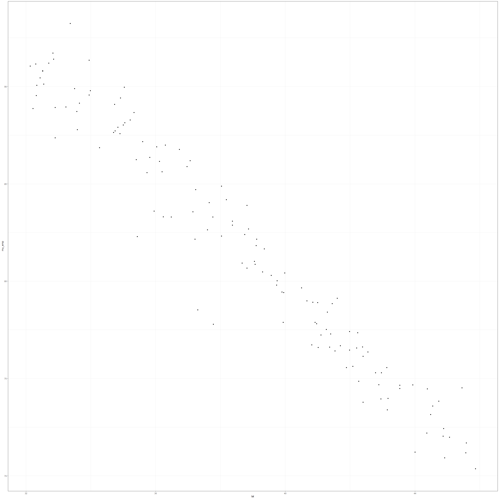
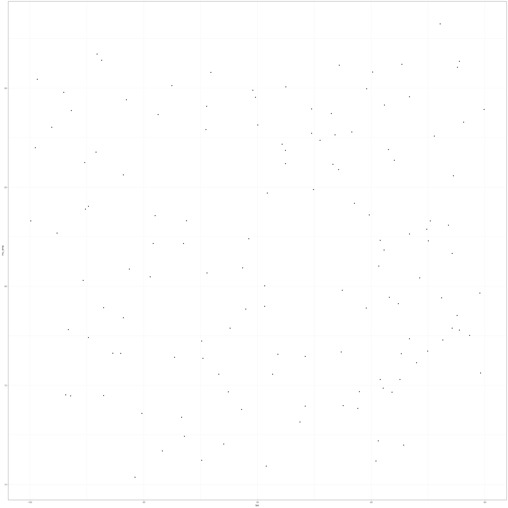
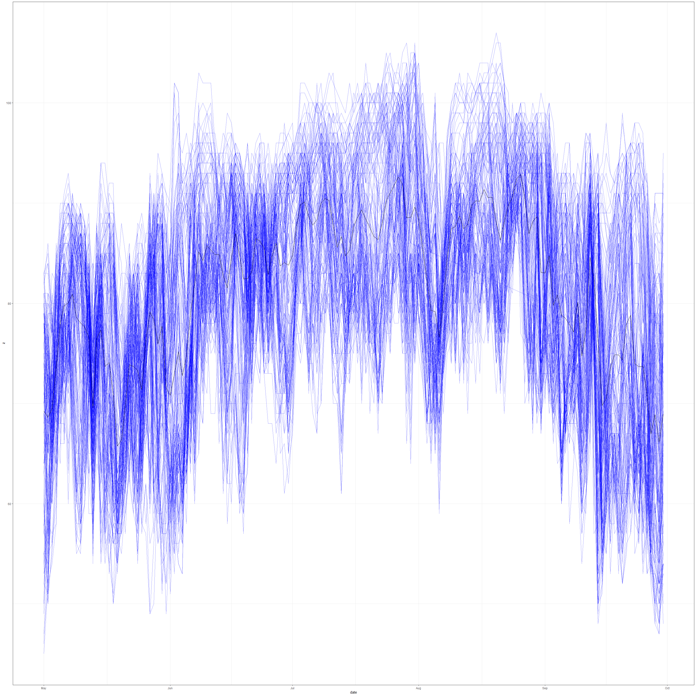
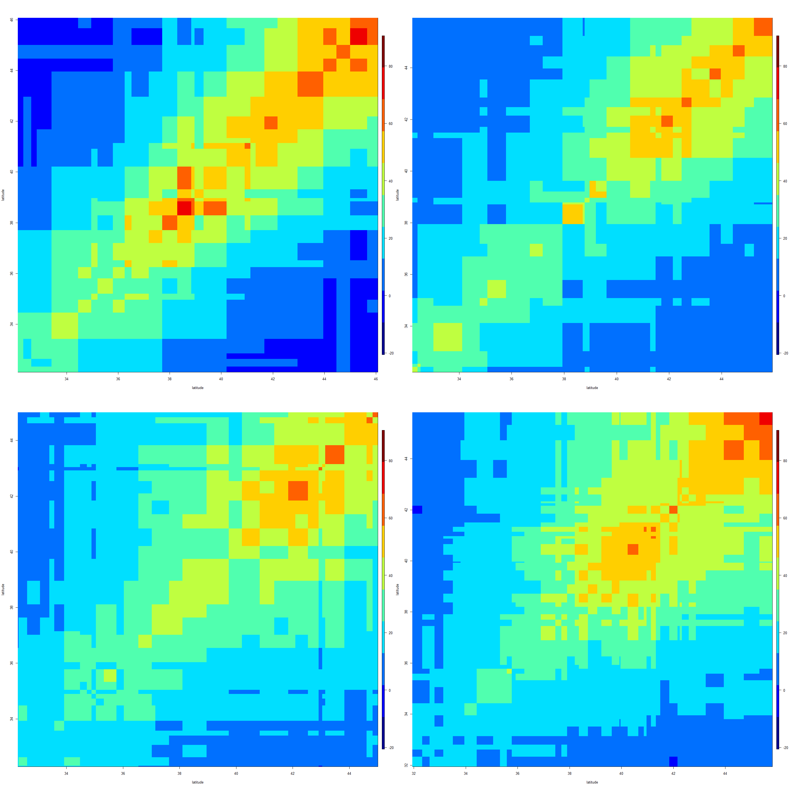
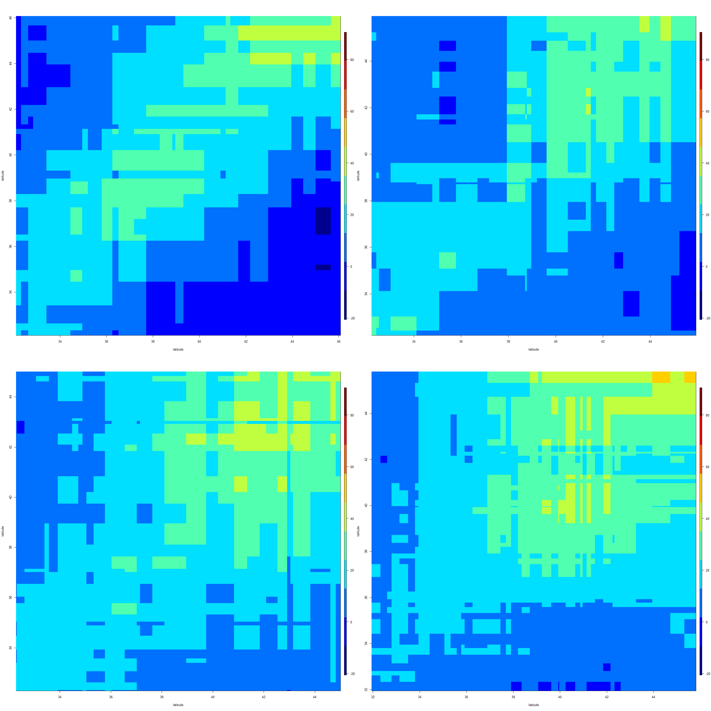
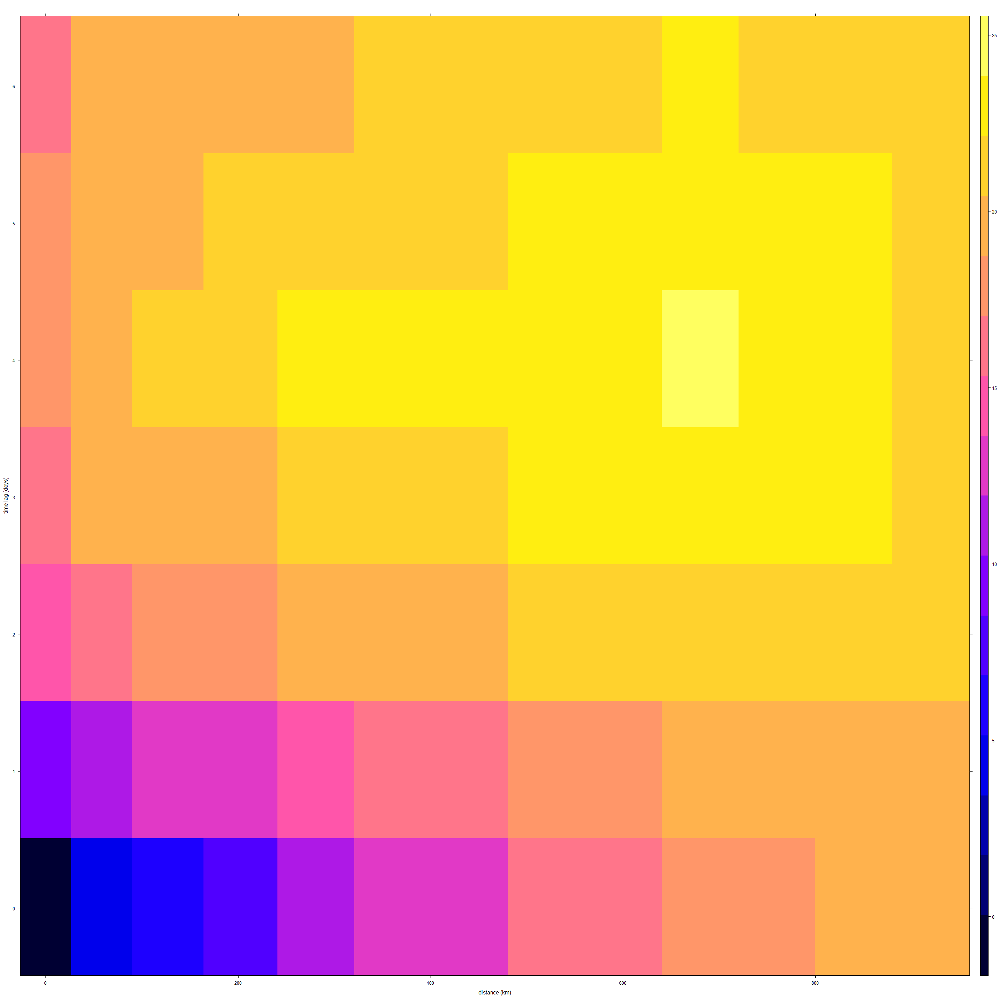

#Lab 2.3: Exploratory Data Analysis


```r
library(CCA)
library(tidyverse)
library(gstat)
library(sp)
library(spacetime)
library(STRbook)

set.seed(1)
```

In this Lab we consider the construction and visualization of the empirical means and covariances, the use of empirical orthogonal functions and their associated principal component time series, semivariogram analysis, and spatio-temporal canonical correlation analysis.


```r
#Data
data("NOAA_df_1990", package = "STRbook")

tmax <- filter(NOAA_df_1990,
               proc == "Tmax" &
               month %in% 5:9 &
               year == 1993)
tmax$t <- tmax$julian - 728049
```

#Empirical Spatial Means


```r
head(tmax)
```

```
##   julian year month day   id  z proc   lat       lon       date t
## 1 728050 1993     5   1 3804 82 Tmax 39.35 -81.43333 1993-05-01 1
## 2 728051 1993     5   2 3804 84 Tmax 39.35 -81.43333 1993-05-02 2
## 3 728052 1993     5   3 3804 79 Tmax 39.35 -81.43333 1993-05-03 3
## 4 728053 1993     5   4 3804 72 Tmax 39.35 -81.43333 1993-05-04 4
## 5 728054 1993     5   5 3804 73 Tmax 39.35 -81.43333 1993-05-05 5
## 6 728055 1993     5   6 3804 78 Tmax 39.35 -81.43333 1993-05-06 6
```


```r
            # group by lon-lat
spat_av <- group_by(tmax,lat, lon) %>% 
  
           # mean for each lon-lat
           summarise(mu_emp = mean(z))

head(spat_av)
```

```
## # A tibble: 6 x 3
## # Groups:   lat [6]
##     lat   lon mu_emp
##   <dbl> <dbl>  <dbl>
## 1  32.1 -81.2   91.0
## 2  32.2 -98.2   88.9
## 3  32.3 -86.4   91.2
## 4  32.3 -90.1   89.5
## 5  32.3 -88.8   90.1
## 6  32.4 -99.7   90.4
```


```r
#plot average maximun temperature per station 

#latitude plot
(lat_means <- ggplot(spat_av)+
             geom_point(aes(lat, mu_emp))+
             theme_bw())
```

<!-- -->


```r
(lon_means <- ggplot(spat_av)+
             geom_point(aes(lon, mu_emp))+
             theme_bw())
```

<!-- -->


#Empirical Temporal Means


```r
tmax_av <- group_by(tmax,date) %>% 
           summarise(meanTmax= mean(z))
```


```r
(gTmaxav <- ggplot()+
   #plot de lineas
  geom_line(data = tmax, aes(x=date, y=z, group= id),
            colour= "blue", alpha= 0.4) +
   #agregar una linea media
   geom_line(data= tmax_av, aes(x= date, y= meanTmax))+
   theme_bw())
```

<!-- -->


#Empirical Covariances

It is important that all trends are removed, one way to do this is to first fit a linear model 
that has spatial and/or temporal covariates. Then plot the empirical covariances of the detrended
data (i.e., the residuals).

We observed a quadratic tendency of temperature over the chosen time span. 


##First fit a linear model 


```r
lm1 <- lm(z ~ lat+ t + I(t^2), data = tmax )

#Store the residuals
tmax$residuals <- residuals(lm1)
```


```r
#Consider the spatial locations
spat_df <- filter(tmax, t==1) %>% 
  #extraer solo lon lat 
  select(lon, lat) %>% 
  
  #ordenar lon lat
  arrange(lon, lat)

#Number of stations
m <- nrow(spat_av)
```


##Compute the empirical covariance matrix

__Ver video para entender matrices de covarianza__
https://www.youtube.com/watch?v=9B5vEVjH2Pk

```r
#First put the data into space-wide format

x <- select(tmax, lon, lat, residuals, t) %>% 
  
  #ponga t en las columnas y muestre los valores de los residuos 
  spread(t, residuals) %>% 
  
  #eliminar lon lat 
  select(-lon, -lat) %>% 

  #make space-wide matrix
  t()
```


```r
#Compute covariance matrix
lag0_cov <- cov(x, use = "complete.obs")

#covariance between the residuals from X excluding the first time point and X
#excluding the last time point
lag1_cov <- cov(x[-1,], x[-nrow(x),], use = "complete.obs")
```


With a roughly square domain, split the domain into either latitudinal or longitudinal strips


```r
spat_df$n <- 1:nrow(spat_df)
lim_lon <- range(spat_df$lon)

#crear 4 long strip boundaries
lon_strips <- seq(lim_lon[1],
                  lim_lon[2],
                  length=5)

spat_df$lon_strip <- cut(spat_df$lon,
                         lon_strips,
                         labels = FALSE,
                         include.lowest = T)  

#Now that we know in which strip each station falls  
head(spat_df)
```

```
##         lon      lat n lon_strip
## 1 -99.96667 37.76667 1         1
## 2 -99.76667 36.30000 2         1
## 3 -99.68333 32.43333 3         1
## 4 -99.05000 35.00000 4         1
## 5 -98.81667 38.86666 5         1
## 6 -98.51667 33.98333 6         1
```


The empirical spatial covariance matrices reveal the presence of spatial correlation in the residuals.


```r
par(mfrow=c(2,2))
plot_cov_strips(lag0_cov, spat_df )
```

<!-- -->

```r
par(mfrow=c(2,2))
plot_cov_strips(lag1_cov, spat_df )
```

<!-- -->


#Semivariogram Analysis

Computing the empirical semivariogram is much faster when
using objects of class __STFDF__ rather than STIDF since the regular space-time structure can
be exploited.


```r
data("STObj3", package= "STRbook")
STObj4 <- STObj3[, "1993-07-01::1993-07-31"]
```


```r
vv <- variogram(object = z~ 1 +lat,
                
                #July data
               data = STObj4,
               
               #spatial bin (80km)
               width=80,
               
               #consider points <1000km apart
               cutoff =1000,
               
               #0 days to 6 days
               tlags= 0.01:6.01)
```


The plot suggests that there are considerable
spatio-temporal correlations in the data; spatio-temporal modeling of the residuals is
thus warranted.

```r
plot(vv)
```

<!-- -->


